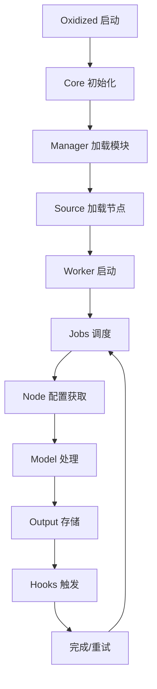
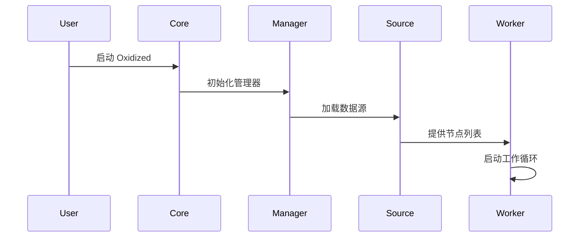

# Oxidized - 网络设备配置备份系统

[](https://github.com/ytti/oxidized/actions/workflows/ruby.yml)
[](http://badge.fury.io/rb/oxidized)
[](https://gitter.im/oxidized/Lobby?utm_source=badge&utm_medium=badge&utm_campaign=pr-badge&utm_content=badge)

Oxidized 是一个网络设备配置备份工具，是 RANCID 的替代品！

它轻量级、可扩展，支持超过 130 种操作系统类型。

## 🚀 核心特性

* **自动线程管理** - 根据配置的检索间隔自动添加/移除线程
* **RESTful API** - 提供 REST API 将节点立即移动到队列头部 (GET/PUT /node/next/[NODE])
* **Syslog 集成** - 通过 UDP+文件捕获配置变更事件 (IOS/JunOS) 并触发配置获取
* **用户追踪** - 可以识别哪个 IOS/JunOS 用户进行了变更，输出模块可以使用此信息
* **Git 集成** - `git` 输出模块使用此信息，`git blame` 将显示谁更改了每一行
* **节点管理** - RESTful API 重新加载节点列表 (GET /reload)
* **配置获取** - RESTful API 获取配置 (/node/fetch/[NODE] 或 /node/fetch/group/[NODE])
* **节点列表** - RESTful API 显示节点列表 (GET /nodes)
* **版本管理** - RESTful API 显示节点版本 (/node/version[NODE]) 和差异

## 📋 目录

1. [支持的操作系统类型](docs/Supported-OS-Types.md)
2. [安装](#安装)
   * [Debian 和 Ubuntu](#debian-和-ubuntu)
   * [Rocky Linux, Red Hat Enterprise Linux](#rocky-linux-red-hat-enterprise-linux)
   * [FreeBSD](#freebsd)
   * [从 Git 构建](#从-git-构建)
   * [Docker & Podman](docs/Docker.md)
3. [初始配置](#配置)
4. [配置文档](docs/Configuration.md)
   * [调试](docs/Configuration.md#debugging)
   * [特权模式](docs/Configuration.md#privileged-mode)
   * [禁用 SSH exec 通道](docs/Configuration.md#disabling-ssh-exec-channels)
   * [数据源](docs/Sources.md)
     * [数据源: CSV](docs/Sources.md#source-csv)
     * [数据源: SQL](docs/Sources.md#source-sql)
     * [数据源: SQLite](docs/Sources.md#source-sqlite)
     * [数据源: Mysql](docs/Sources.md#source-mysql)
     * [数据源: HTTP](docs/Sources.md#source-http)
   * [输出](docs/Outputs.md)
     * [输出: GIT](docs/Outputs.md#output-git)
     * [输出: GIT-Crypt](docs/Outputs.md#output-git-crypt)
     * [输出: HTTP](docs/Outputs.md#output-http)
     * [输出: File](docs/Outputs.md#output-file)
     * [输出类型](docs/Outputs.md#output-types)
   * [高级配置](docs/Configuration.md#advanced-configuration)
   * [高级组配置](docs/Configuration.md#advanced-group-configuration)
   * [钩子](docs/Hooks.md)
     * [钩子: exec](docs/Hooks.md#hook-type-exec)
     * [钩子: githubrepo](docs/Hooks.md#hook-type-githubrepo)
     * [钩子: awssns](docs/Hooks.md#hook-type-awssns)
     * [钩子: slackdiff](docs/Hooks.md#hook-type-slackdiff)
     * [钩子: xmppdiff](docs/Hooks.md#hook-type-xmppdiff)
     * [钩子: ciscosparkdiff](docs/Hooks.md#hook-type-ciscosparkdiff)
5. [创建和扩展模型](docs/Creating-Models.md)
6. [帮助](#帮助)
7. [需要帮助](#需要帮助)
8. [Ruby API](docs/Ruby-API.md#ruby-api)
   * [输入](docs/Ruby-API.md#input)
   * [输出](docs/Ruby-API.md#output)
   * [数据源](docs/Ruby-API.md#source)
   * [模型](docs/Ruby-API.md#model)

## 🏗️ 系统架构

Oxidized 采用模块化架构，主要组件包括：

### 核心组件

- **Core** - 系统核心控制器，负责初始化和协调各组件
- **Manager** - 模块管理器，动态加载和管理各种模块
- **Worker** - 工作器，管理线程池和任务调度
- **Jobs** - 任务队列，处理并发任务执行

### 数据流组件

- **Source** - 数据源模块，从各种来源获取节点信息
- **Model** - 设备模型，处理不同厂商设备的配置获取
- **Output** - 输出模块，将配置存储到不同目标
- **Hooks** - 钩子系统，提供事件驱动的扩展机制

### 系统架构图



详细架构说明请参考 [架构流程图](docs/Architecture-Flow.md)

## 🛠️ 安装

### Debian 和 Ubuntu

推荐使用 Debian "buster" 或更新版本，以及 Ubuntu 17.10 (artful) 或更新版本。在 Ubuntu 上，首先启用 `universe` 仓库（libssh2-1-dev 需要）：

```shell
add-apt-repository universe
```

安装依赖：

```shell
apt install ruby ruby-dev libsqlite3-dev libssl-dev pkg-config cmake libssh2-1-dev libicu-dev zlib1g-dev g++ libyaml-dev
```

最后，安装 Oxidized：

```shell
gem install oxidized
```

您还可以安装一个或两个可选 gem。它们不是运行 Oxidized 所必需的：

```shell
gem install oxidized-web    # Web 界面和 REST API
gem install oxidized-script # 基于脚本的输入/输出扩展
```

### Rocky Linux, Red Hat Enterprise Linux

这些说明已在 Rocky Linux 9.3 和 Fedora 上验证。

在 Rocky Linux 9 上，您需要安装/启用 EPEL、CRB 和 Ruby 3.1：

```shell
dnf install epel-release
dnf config-manager --set-enabled crb
dnf module enable ruby:3.1
```

然后您需要 oxidized 所需的包：

```shell
dnf -y install ruby ruby-devel sqlite-devel openssl-devel pkgconf-pkg-config cmake libssh-devel libicu-devel zlib-devel gcc-c++ libyaml-devel which
```

最后，安装 Oxidized：

```shell
gem install oxidized
```

您还可以安装一个或两个可选 gem：

```shell
gem install oxidized-web    # Web 界面和 REST API
gem install oxidized-script # 基于脚本的输入/输出扩展
```

### FreeBSD

这些安装说明已在 FreeBSD 14.2 上测试，但 oxidized 本身尚未在其上测试。

首先安装 ruby 和 rubyXX-gems（使用 `pkg search gems` 查找包名）：

```shell
pkg install ruby
pkg install ruby32-gems
```

然后安装 oxidized 和 oxidized-web 的依赖：

```shell
pkg install ruby ruby-gems git sqlite3 libssh2 cmake pkgconf gmake
pkg install libyaml icu   # oxidized-web 的依赖
```

最后，安装 Oxidized：

```shell
gem install oxidized
```

您还可以安装一个或两个可选 gem：

```shell
gem install oxidized-web    # Web 界面和 REST API
gem install oxidized-script # 基于脚本的输入/输出扩展
```

Oxidized 也可通过 [FreeBSD ports](https://ports.freebsd.org/cgi/ports.cgi?query=oxidized) 获得：

```shell
pkg install rubygem-oxidized rubygem-oxidized-script rubygem-oxidized-web
```

### 从 Git 构建

```shell
git clone https://github.com/ytti/oxidized.git
cd oxidized/
gem install bundler
rake install
```

### 使用 Docker 或 Podman 运行

参见 [docs/Docker.md](docs/Docker.md)

## ⚙️ 配置

Oxidized 配置采用 YAML 格式。配置文件依次从 `/etc/oxidized/config` 然后 `~/.config/oxidized/config` 加载。哈希将被合并，这对于在系统范围文件中存储源信息并在主目录中存储用户特定配置（仅包含员工特定的用户名和密码）很有用。

建议使用专用用户名运行 Oxidized。可以使用标准命令行工具添加此用户名：

```shell
useradd -s /bin/bash -m oxidized
```

> 建议**不要**以 root 身份运行 Oxidized。创建专用用户后，使用 `su oxidized` 切换到 oxidized 用户，以确保 Oxidized 在正确的用户上下文中运行。

要在主目录 `~/.config/oxidized/config` 中初始化默认配置，只需运行 `oxidized` 一次。如果您不进一步配置输出和源部分，它将在后续的 `oxidized` 执行中扩展示例。这对于查看特定源或输出后端的可用选项很有用。

您可以设置环境变量 `OXIDIZED_HOME` 来更改其主目录。

```shell
OXIDIZED_HOME=/etc/oxidized

$ tree -L 1 /etc/oxidized
/etc/oxidized/
├── config
├── log-router-ssh
├── log-router-telnet
├── pid
├── router.db
└── repository.git
```

## 📊 数据源

Oxidized 支持 [CSV](docs/Configuration.md#source-csv)、[SQLite](docs/Configuration.md#source-sqlite)、[MySQL](docs/Configuration.md#source-mysql) 和 [HTTP](docs/Configuration.md#source-http) 作为源后端。CSV 后端从 rancid 兼容的 router.db 文件读取节点。SQLite 和 MySQL 后端将对数据库执行查询并将某些字段映射到模型项。HTTP 后端将对 http/https url 执行查询。查看 [配置](docs/Configuration.md) 了解更多详细信息。

## 📤 输出

可能的输出是 [File](docs/Configuration.md#output-file)、[GIT](docs/Configuration.md#output-git)、[GIT-Crypt](docs/Configuration.md#output-git-crypt) 和 [HTTP](docs/Configuration.md#output-http)。文件后端将目标目录作为参数，每个设备保留一个文件，包含设备的最新运行版本。GIT 后端（推荐）将在指定路径中初始化一个空的 GIT 仓库，并在每次配置更改时创建新提交。GIT-Crypt 后端也将初始化一个 GIT 仓库，但推送到它的每个配置都将通过使用 `git-crypt` 工具进行加密。查看 [配置](docs/Configuration.md) 了解更多详细信息。

映射定义如何将模型的字段映射到模型 [模型字段](https://github.com/ytti/oxidized/tree/master/lib/oxidized/model)。大多数设置应该是不言自明的，如果 `use_syslog` 设置为 `true`，则忽略日志。

首先创建 CSV `output` 将存储设备配置的目录并启动 Oxidized 一次。

```shell
mkdir -p ~/.config/oxidized/configs
oxidized
```

现在告诉 Oxidized 在哪里找到要备份配置的网络设备列表。您可以使用 CSV 或 SQLite 作为源。要创建 CSV 源，请添加以下代码片段：

```yaml
source:
  default: csv
  csv:
    file: ~/.config/oxidized/router.db
    delimiter: !ruby/regexp /:/
    map:
      name: 0
      model: 1
```

现在让我们创建一个基于文件的设备数据库（您可能稍后想切换到 SQLite）。将您的路由器放在 `~/.config/oxidized/router.db` 中（文件格式与 rancid 兼容）。只需每行添加一个项目：

```text
router01.example.com:ios
switch01.example.com:procurve
router02.example.com:ios
```

再次运行 `oxidized` 进行首次备份。

## 🔧 工作原理

### 1. 系统初始化



### 2. 任务执行流程

1. **节点发现** - 从配置的数据源加载设备列表
2. **任务调度** - 根据配置的间隔和线程数调度任务
3. **设备连接** - 使用 SSH、Telnet 或 HTTP 连接设备
4. **配置获取** - 执行设备特定的命令获取配置
5. **数据处理** - 清理和标准化配置数据
6. **存储输出** - 将配置保存到 Git、文件或 HTTP 目标
7. **钩子触发** - 执行成功或失败的钩子函数

### 3. 错误处理机制

- **重试机制** - 失败的任务会根据配置进行重试
- **超时处理** - 防止任务无限期挂起
- **错误记录** - 详细的错误日志和统计信息
- **故障恢复** - 自动恢复机制确保系统稳定性

## 🎯 核心特性详解

### 自动线程管理

Oxidized 根据配置的检索间隔自动调整工作线程数量，确保：

- **资源优化** - 避免过度使用系统资源
- **性能平衡** - 在速度和资源消耗之间找到平衡
- **动态调整** - 根据负载自动调整并发数

### RESTful API

提供完整的 REST API 支持：

- **节点管理** - 获取、更新、删除节点
- **任务控制** - 立即执行特定节点的配置获取
- **状态查询** - 获取系统状态和统计信息
- **配置管理** - 动态重新加载配置

### Syslog 集成

通过 Syslog 捕获配置变更事件：

- **实时触发** - 配置变更时立即获取新配置
- **用户追踪** - 识别进行变更的用户
- **变更历史** - 完整的配置变更历史记录

### 钩子系统

事件驱动的扩展机制：

- **成功钩子** - 配置成功获取后的处理
- **失败钩子** - 处理失败情况
- **完成钩子** - 整个周期完成后的处理
- **自定义钩子** - 支持自定义钩子函数

## 🔒 安全特性

### 敏感信息处理

- **密码隐藏** - 自动隐藏配置中的密码信息
- **密钥保护** - 保护 SNMP 社区字符串和认证密钥
- **时间戳清理** - 移除动态时间信息
- **访问控制** - 基于角色的访问控制

### 数据保护

- **加密存储** - 支持 Git-Crypt 加密存储
- **审计日志** - 完整的操作审计日志
- **备份策略** - 自动备份和版本控制
- **恢复机制** - 快速恢复机制

## 📈 性能优化

### 并发处理

- **多线程** - 支持多线程并发处理
- **任务队列** - 智能任务调度和队列管理
- **资源控制** - 防止资源过度使用
- **负载均衡** - 自动负载均衡

### 内存管理

- **流式处理** - 大文件流式处理
- **内存优化** - 高效的内存使用
- **垃圾回收** - 自动内存清理
- **缓存机制** - 智能缓存策略

## 🚀 扩展开发

### 自定义模型

创建新的设备模型：

```ruby
class MyDevice < Oxidized::Model
  using Refinements
  
  # 设置提示符
  prompt /^[\w.@()-]+[#>]\s?$/
  
  # 设置注释字符
  comment '# '
  
  # 处理敏感信息
  cmd :secret do |cfg|
    cfg.gsub! /^(password )\S+/, '\1<secret hidden>'
    cfg
  end
  
  # 获取配置
  cmd 'show running-config'
  
  # 连接配置
  cfg :ssh do
    post_login 'terminal length 0'
    pre_logout 'exit'
  end
end
```

### 自定义输出

创建新的输出模块：

```ruby
class MyOutput < Oxidized::Output
  def store(node, config, opt = {})
    # 自定义存储逻辑
    true
  end
  
  def fetch(node, group)
    # 自定义获取逻辑
    config
  end
end
```

### 自定义钩子

创建新的钩子：

```ruby
class MyHook < Oxidized::Hook
  def run_hook(ctx)
    # 自定义钩子逻辑
  end
end
```

## 📚 文档结构

- **配置文档** - 详细的配置选项说明
- **模型文档** - 设备模型开发指南
- **API 文档** - REST API 完整参考
- **钩子文档** - 钩子系统使用指南
- **故障排除** - 常见问题和解决方案

## 🤝 贡献指南

我们欢迎各种形式的贡献：

- **代码贡献** - 新功能、错误修复、性能优化
- **文档改进** - 文档更新、翻译、示例
- **测试支持** - 测试用例、自动化测试
- **社区支持** - 问题报告、功能请求、讨论

## 📞 获取帮助

如果您需要 Oxidized 的帮助，我们提供几种方法：

* [Gitter](https://gitter.im/oxidized/Lobby?utm_source=badge&utm_medium=badge&utm_campaign=pr-badge&utm_content=badge) - 您可以加入 Gitter 上的 Lobby 与其他 Oxidized 用户聊天
* [GitHub](https://github.com/ytti/oxidized/) - 获取帮助和代码更改/更新请求
* [论坛](https://community.librenms.org/c/help/oxidized) - 由 [LibreNMS](https://github.com/librenms/librenms) 运行的用户论坛，您可以在其中寻求帮助和支持

## 🆘 需要帮助

目前，`oxidized` 由很少的人维护。
我们欢迎更多个人和公司参与 Oxidized。

除了 Oxidized 的软件开发、文档或维护之外，您还可以成为模型维护者，这可以以很少的负担完成，对社区来说将是很大的帮助。

感兴趣？查看 [CONTRIBUTING.md](CONTRIBUTING.md)。

## 📄 许可证和版权

版权所有
2013-2015 Saku Ytti <saku@ytti.fi>
2013-2015 Samer Abdel-Hafez <sam@arahant.net>

根据 Apache 许可证 2.0 版（"许可证"）许可；
除非符合许可证，否则您不得使用此文件。
您可以在以下网址获得许可证副本：

http://www.apache.org/licenses/LICENSE-2.0

除非适用法律要求或书面同意，否则根据许可证分发的软件按"原样"分发，不提供任何明示或暗示的保证或条件。
请参阅许可证了解管理权限和限制的具体语言。
