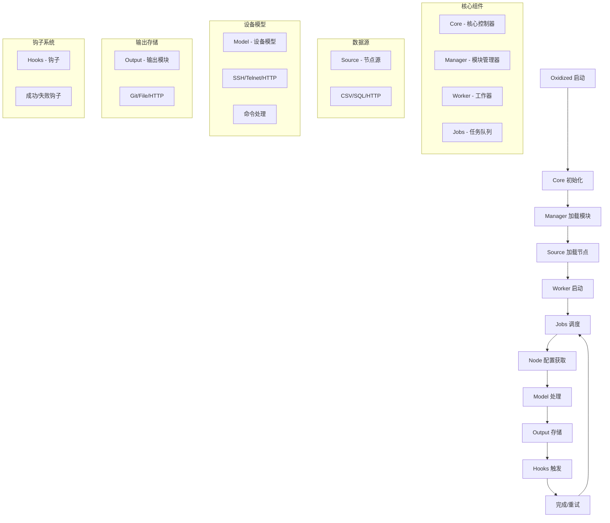
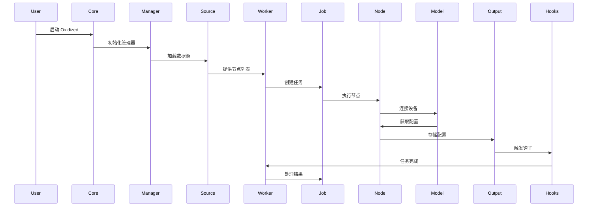
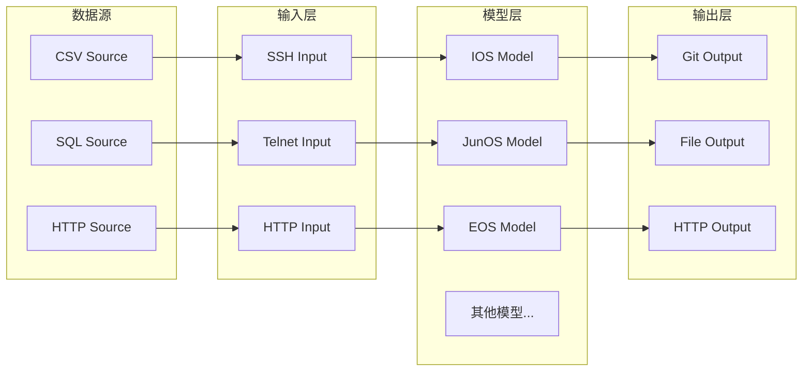
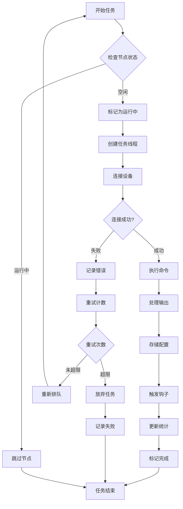
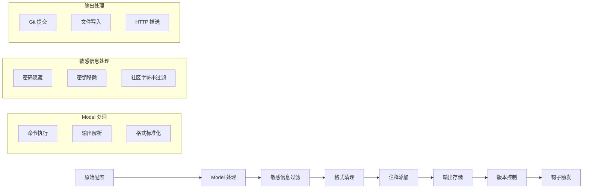
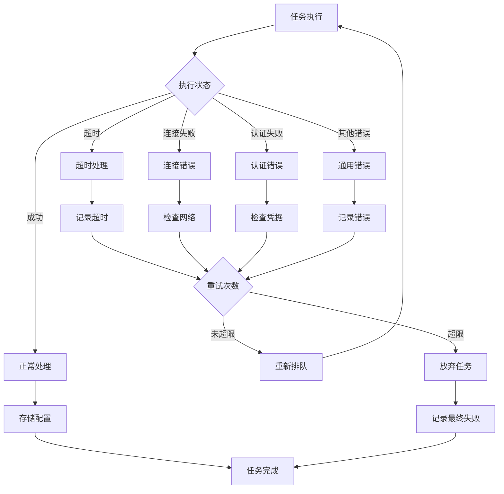
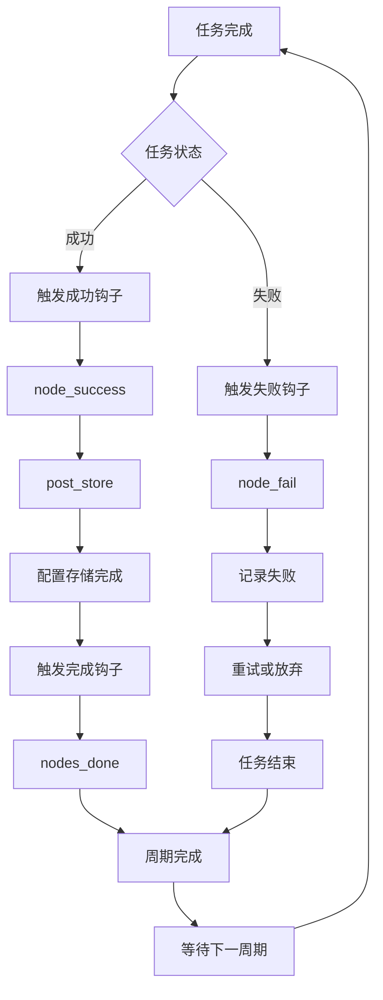
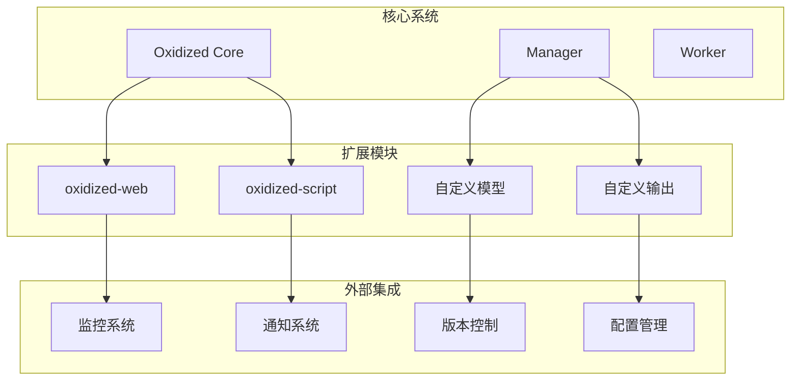
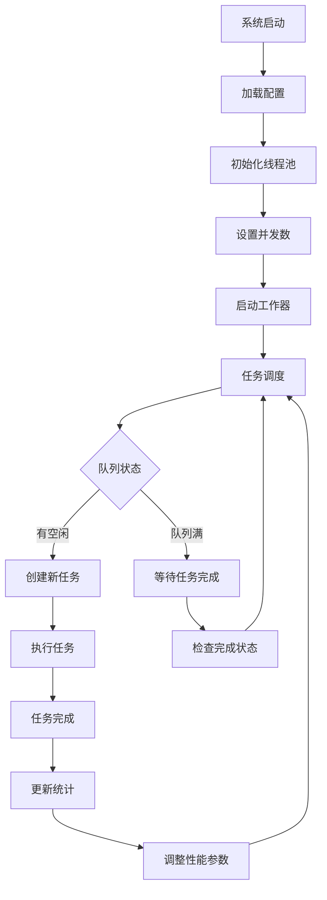
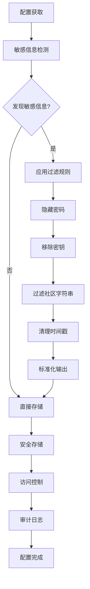

# Oxidized 系统架构流程图

## 系统整体架构

## 详细工作流程

## 模块关系图

## 任务执行流程

## 配置处理流程

## 错误处理流程

## 钩子系统流程

## 扩展系统架构

## 性能优化流程

## 安全处理流程

这个架构流程图展示了 Oxidized 系统的完整工作原理，包括：

1. **系统初始化流程** - 从启动到运行
2. **任务执行流程** - 从节点获取到配置存储
3. **模块关系** - 各组件之间的依赖关系
4. **错误处理** - 异常情况的处理机制
5. **钩子系统** - 事件驱动的扩展机制
6. **性能优化** - 并发处理和资源管理
7. **安全处理** - 敏感信息保护机制

每个流程都经过精心设计，确保系统的可靠性、可扩展性和安全性。
