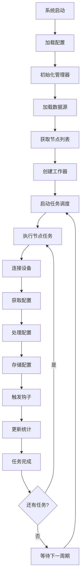
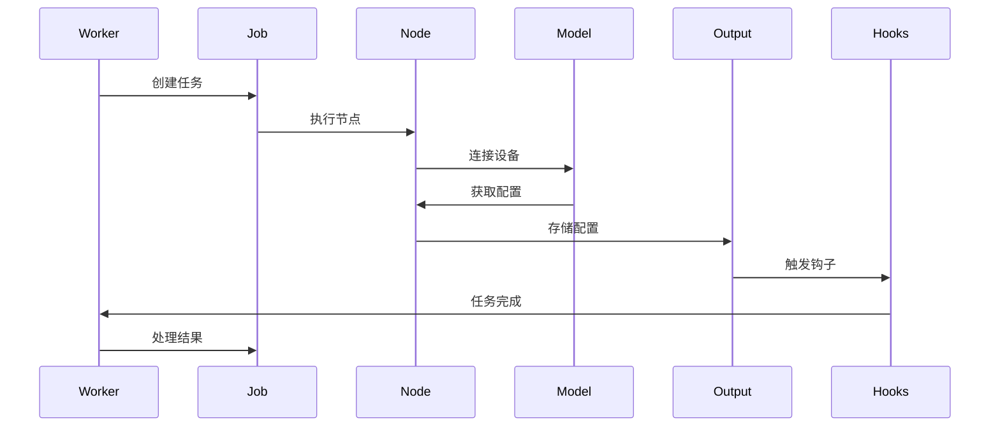

# Oxidized 系统架构详解

## 概述

Oxidized 是一个网络设备配置备份系统，采用模块化架构设计，支持超过 130 种网络设备操作系统。系统通过多线程并发处理，自动从各种数据源获取设备列表，连接设备获取配置，并将配置存储到不同的目标系统。

## 核心架构

### 1. 系统层次结构

```
┌─────────────────────────────────────────────────────────────┐
│                    Oxidized 系统架构                          │
├─────────────────────────────────────────────────────────────┤
│  应用层    │  Web UI  │  REST API  │  CLI  │  扩展模块        │
├─────────────────────────────────────────────────────────────┤
│  核心层    │  Core    │  Manager   │  Worker │  Jobs         │
├─────────────────────────────────────────────────────────────┤
│  模块层    │  Source  │  Model     │  Output │  Hooks        │
├─────────────────────────────────────────────────────────────┤
│  协议层    │  SSH     │  Telnet    │  HTTP   │  FTP          │
├─────────────────────────────────────────────────────────────┤
│  存储层    │  Git     │  File      │  HTTP   │  Database     │
└─────────────────────────────────────────────────────────────┘
```

### 2. 核心组件详解

#### Core (核心控制器)
- **职责**: 系统初始化和协调
- **功能**: 
  - 初始化所有组件
  - 管理工作器线程
  - 处理系统信号
  - 加载扩展模块

#### Manager (模块管理器)
- **职责**: 动态加载和管理各种模块
- **功能**:
  - 加载输入模块 (SSH, Telnet, HTTP)
  - 加载输出模块 (Git, File, HTTP)
  - 加载数据源模块 (CSV, SQL, HTTP)
  - 加载设备模型 (IOS, JunOS, EOS 等)
  - 加载钩子模块

#### Worker (工作器)
- **职责**: 管理工作线程池和任务调度
- **功能**:
  - 管理线程池
  - 调度任务执行
  - 处理任务完成
  - 管理重试逻辑

#### Jobs (任务队列)
- **职责**: 处理并发任务执行
- **功能**:
  - 任务队列管理
  - 并发控制
  - 任务状态跟踪
  - 性能统计

## 数据流架构

### 1. 数据获取流程



### 2. 节点处理流程



## 模块架构

### 1. 输入模块 (Input)

负责与网络设备建立连接和通信：

#### SSH 输入模块
```ruby
class SSH < Oxidized::Input
  def connect(node)
    # SSH 连接逻辑
  end
  
  def cmd(command)
    # 命令执行逻辑
  end
end
```

#### Telnet 输入模块
```ruby
class Telnet < Oxidized::Input
  def connect(node)
    # Telnet 连接逻辑
  end
  
  def cmd(command)
    # 命令执行逻辑
  end
end
```

#### HTTP 输入模块
```ruby
class HTTP < Oxidized::Input
  def connect(node)
    # HTTP 连接逻辑
  end
  
  def cmd(command)
    # HTTP 请求逻辑
  end
end
```

### 2. 设备模型 (Model)

处理不同厂商设备的配置获取：

#### 基础模型结构
```ruby
class BaseModel < Oxidized::Model
  using Refinements
  
  # 设置提示符
  prompt /^[\w.@()-]+[#>]\s?$/
  
  # 设置注释字符
  comment '# '
  
  # 处理敏感信息
  cmd :secret do |cfg|
    cfg.gsub! /^(password )\S+/, '\1<secret hidden>'
    cfg
  end
  
  # 获取配置
  cmd 'show running-config'
  
  # 连接配置
  cfg :ssh do
    post_login 'terminal length 0'
    pre_logout 'exit'
  end
end
```

#### 具体设备模型示例

**Cisco IOS 模型**
```ruby
class IOS < Oxidized::Model
  using Refinements
  
  prompt /^([\w.@()-]+[#>]\s?)$/
  comment '! '
  
  cmd :secret do |cfg|
    cfg.gsub! /^(enable secret) \d+ \S+/, '\1 <secret hidden>'
    cfg.gsub! /^(username \S+ password) \d+ \S+/, '\1 <secret hidden>'
    cfg
  end
  
  cmd 'show version' do |cfg|
    comment cfg
  end
  
  cmd 'show running-config' do |cfg|
    cfg
  end
end
```

**Juniper JunOS 模型**
```ruby
class JunOS < Oxidized::Model
  using Refinements
  
  prompt /^[\w.@-]+>\s?$/
  comment '## '
  
  cmd :secret do |cfg|
    cfg.gsub! /^(set system login user \S+ authentication encrypted-password) \S+/, '\1 <secret hidden>'
    cfg
  end
  
  cmd 'show version' do |cfg|
    comment cfg
  end
  
  cmd 'show configuration | display set' do |cfg|
    cfg
  end
end
```

### 3. 输出模块 (Output)

负责将配置存储到不同目标：

#### Git 输出模块
```ruby
class Git < Oxidized::Output
  def store(node, config, opt = {})
    # Git 存储逻辑
    git = Git.new(@path)
    git.add(node.name, config)
    git.commit(opt[:msg])
    true
  end
  
  def fetch(node, group)
    # Git 获取逻辑
    git = Git.new(@path)
    git.show(node.name)
  end
end
```

#### 文件输出模块
```ruby
class File < Oxidized::Output
  def store(node, config, opt = {})
    # 文件存储逻辑
    File.write(File.join(@path, node.name), config)
    true
  end
  
  def fetch(node, group)
    # 文件获取逻辑
    File.read(File.join(@path, node.name))
  end
end
```

### 4. 数据源模块 (Source)

从各种来源获取设备列表：

#### CSV 数据源
```ruby
class CSV < Oxidized::Source
  def load(node_want = nil)
    # CSV 文件读取逻辑
    nodes = []
    CSV.foreach(@file) do |row|
      nodes << {
        name: row[0],
        model: row[1],
        ip: row[2]
      }
    end
    nodes
  end
end
```

#### SQL 数据源
```ruby
class SQL < Oxidized::Source
  def load(node_want = nil)
    # SQL 查询逻辑
    nodes = []
    @db.execute(@query) do |row|
      nodes << {
        name: row['name'],
        model: row['model'],
        ip: row['ip']
      }
    end
    nodes
  end
end
```

## 并发处理架构

### 1. 线程池管理

```ruby
class Jobs
  def initialize(threads, use_max_threads, interval, nodes)
    @threads = threads
    @use_max_threads = use_max_threads
    @interval = interval
    @nodes = nodes
    @jobs = []
  end
  
  def work
    # 任务调度逻辑
    @jobs.each do |job|
      next if job.alive?
      process(job)
    end
  end
end
```

### 2. 任务执行流程

```ruby
class Job < Thread
  def initialize(node)
    @node = node
    @start = Time.now.utc
    super do
      begin
        Timeout.timeout(Oxidized.config.timelimit) do
          @status, @config = @node.run
        end
      rescue Timeout::Error
        @status = :timelimit
      ensure
        @end = Time.now.utc
        @time = @end - @start
      end
    end
  end
end
```

## 错误处理架构

### 1. 异常层次结构

```ruby
module Oxidized
  class OxidizedError < StandardError; end
  class NoNodesFound < OxidizedError; end
  class NodeNotFound < OxidizedError; end
  class ModelNotFound < OxidizedError; end
  class NotSupported < OxidizedError; end
end
```

### 2. 重试机制

```ruby
def process_failure(node, job)
  if node.retry < Oxidized.config.retries
    node.retry += 1
    @nodes.next(node.name)
  else
    node.retry = 0
    Oxidized.hooks.handle :node_fail, node: node, job: job
  end
end
```

## 钩子系统架构

### 1. 钩子类型

```ruby
module Oxidized
  class Hook
    def run_hook(ctx)
      # 钩子执行逻辑
    end
  end
end
```

### 2. 钩子事件

- **node_success** - 节点配置获取成功
- **node_fail** - 节点配置获取失败
- **post_store** - 配置存储后
- **nodes_done** - 所有节点处理完成

### 3. 钩子示例

```ruby
class SlackHook < Oxidized::Hook
  def run_hook(ctx)
    if ctx[:node]
      send_slack_message("Node #{ctx[:node].name} updated")
    end
  end
end
```

## 性能优化架构

### 1. 内存管理

```ruby
class Worker
  def work
    # 清理已完成的任务
    ended = []
    @jobs.delete_if { |job| ended << job unless job.alive? }
    ended.each { |job| process(job) }
  end
end
```

### 2. 并发控制

```ruby
class Jobs
  def work
    while @jobs.size < @jobs.want
      nextnode = @nodes.first
      break if should_skip?(nextnode)
      
      node = @nodes.get
      @jobs.push Job.new(node)
    end
  end
end
```

## 安全架构

### 1. 敏感信息处理

```ruby
cmd :secret do |cfg|
  cfg.gsub! /^(password )\S+/, '\1<secret hidden>'
  cfg.gsub! /^(snmp-server community) \S+/, '\1 <secret hidden>'
  cfg
end
```

### 2. 访问控制

```ruby
class Node
  def run
    # 连接设备
    input = @input.new
    input.connect(self)
    
    # 获取配置
    config = input.cmd(@model.cmd)
    
    # 处理敏感信息
    config = @model.secret(config)
    
    [:success, config]
  end
end
```

## 扩展架构

### 1. 插件系统

```ruby
class Plugin
  def initialize(config)
    @config = config
  end
  
  def setup
    # 插件初始化
  end
  
  def run
    # 插件执行逻辑
  end
end
```

### 2. 扩展加载

```ruby
class Manager
  def add_extension(name)
    require "oxidized/extension/#{name}"
    klass = Object.const_get("Oxidized::#{name.capitalize}")
    @extensions[name] = klass.new
  end
end
```

## 监控和日志架构

### 1. 日志系统

```ruby
class Logger
  def initialize
    @logger = SemanticLogger[self.class]
  end
  
  def info(message)
    @logger.info(message)
  end
  
  def error(message)
    @logger.error(message)
  end
end
```

### 2. 统计信息

```ruby
class Stats
  def initialize
    @stats = {
      total: 0,
      success: 0,
      failed: 0,
      retries: 0
    }
  end
  
  def add(job)
    @stats[:total] += 1
    case job.status
    when :success
      @stats[:success] += 1
    when :fail
      @stats[:failed] += 1
    end
  end
end
```

## 配置管理架构

### 1. 配置层次

```yaml
# 系统配置
source:
  default: csv
  csv:
    file: /etc/oxidized/router.db

# 输出配置
output:
  default: git
  git:
    user: oxidized
    email: oxidized@example.com
    repo: /var/lib/oxidized/repository.git

# 模型配置
model:
  default: ios
  ios:
    username: admin
    password: secret
```

### 2. 配置验证

```ruby
class Config
  def validate
    validate_source
    validate_output
    validate_model
  end
  
  private
  
  def validate_source
    raise "Source not configured" unless @source
  end
end
```

这个架构文档详细说明了 Oxidized 系统的各个组件和它们之间的关系，为开发者提供了深入理解系统工作原理的指南。
